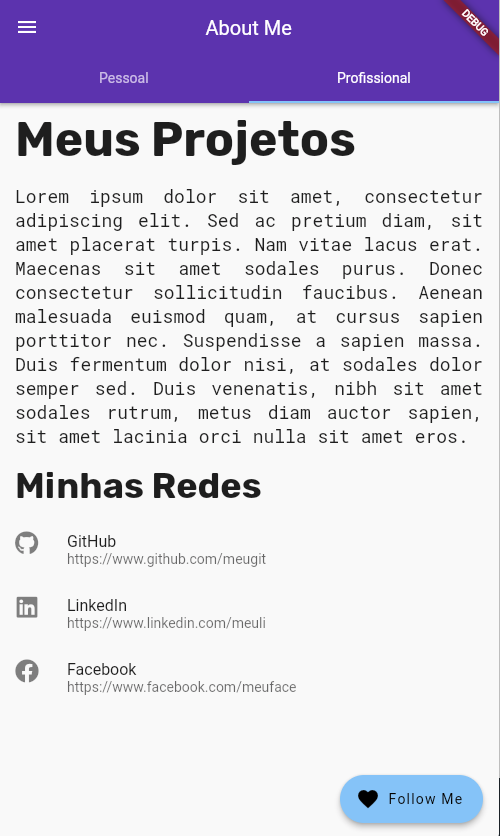

# f290_acf_about_me

## Getting Started

Este projeto tem por objetivo apresentar a estrutura de projetos Flutter e o uso do `Scaffold` em
aplicativos baseados no Android Material Design.

## Projeto Flutter

Crie um novo projeto Flutter para que possamos modificá-lo para utilização de uma estrutura mínima de projeto Flutter e depois utilizar os recursos do Widget `Scaffold`.

### Steps

#### Criando a estrutura do App utilizando Scaffold

1. Remova todo código da classe `main.dart` e substitua pelo trecho abaixo.

```dart
import 'package:flutter/material.dart';

main() => runApp(MyApp());

class MyApp extends StatelessWidget {
  @override
  Widget build(BuildContext context) {
    return MaterialApp(
      home: MyHomePage(),
    );
  }
}
```

> Esta é a estrutura minima para criacao de um App Flutter. Iremos pular alguns passos apresentados em video na sala de aula para agilizar o uso do Scaffold

2. Crie o `MyHomePage()`, esta classe irá representar uma tela de nosso App, será a `home` do nosso App, visto que poderemos ter varias telas. Inclua o trecho abaixo para criá-lo.

```dart
class MyHomePage extends StatelessWidget {
  const MyHomePage({Key? key}) : super(key: key);

  @override
  Widget build(BuildContext context) {
    return Scaffold(
    );
  }
}
```

> Neste ponte temos 2 Widgets, o `MyApp` que é base do aplicativo pois ele esta retornando o `MaterialApp` (estrututa para apps Android) com e este, exibirá o Widget `MyHomePage` como sua página principal.

#### Incluindo os componentes do Scaffold

1. Inclua a `AppBar` e ajuste o título do App. Atualize o código Scaffol.

```dart
@override
Widget build(BuildContext context) {
  return Scaffold(
    appBar: AppBar(title: Text('AppBar')),
  );
}
```

2. Inclua a `body`, o conteúdo do App.

```dart
@override
Widget build(BuildContext context) {
  return Scaffold(
    appBar: AppBar(title: Text('ArrBar')),
    body: Cemter(child: Text('Body')),
  );
}
```

3. Inclua o `FAB` (FloatingActionButton), como ação principal do App.

```dart
@override
Widget build(BuildContext context) {
  return Scaffold(
    appBar: AppBar(title: Text('ArrBar')),
    body: Cemter(child: Text('Body')),
    floatingActionButton: FloatingActionButton.extended(
      onPressed: () {},
      label: Text('FAB'),
      icon: Icon(Icons.favorite),
    ),
  );
}
```

4. Inclua o `Drawer` (FloatingActionButton), como ação principal do App.

```dart
@override
Widget build(BuildContext context) {
  return Scaffold(
    appBar: AppBar(title: Text('ArrBar')),
    drawer: Drawer(),
    body: Center(child: Text('Body')),
    floatingActionButton: FloatingActionButton.extended(
      onPressed: () {},
      label: Text('FAB'),
      icon: Icon(Icons.favorite),
    ),
  );
}
```

5. Execute o aplicativo ou teste no dartpad.dev para visualizar o `content area` da propriedade **body** conteúdo do Scaffold e os demais componentes adicionados.


> Chegando a este step, aproveite para testar o Hot Reload e Hot Restart; altere o título da AppBar, o conteudo no Body, altere a cor do App e visualize.

#### Adicionando conteúdo ao Scaffold

Neste ponto já criamos a estrutura do App com um Scaffold e iremos adicionar o conteúdo ao App.
É importante que voce compreenda a estrutura utiliza para podermos prosseguir conhecendo novos Widgets de conteúdo e Widgets de Layout; nossa widget tree tente a crescer e compreende-la desde os primeiros nós fará toda a diferença.

> O trecho abaixo trás uma coluna completa, mas recomendo que você adicione os Widgets um por vez e explore as propriedades de cada um deles para potencializar seu entendimento.

1. Inclua as variaveis url e sobre na classe `MyHomePage`.

```dart

class MyHomePage extends StatelessWidget {
  const MyHomePage({Key? key}) : super(key: key);

  final sobreMim = 'Descrição sobre você, afinal é um app sobre você!';
  final urlImagem = 'Link para uma imagem super estilosa sua!';
  
  // Restante do código aqui...
}
```

2. Remova o widget center da propriedade `body` e inclua o trecho abaixo.

```dart
    Column(
        mainAxisAlignment: MainAxisAlignment.start,
        children: [
          Image.network(
            urlImagem,
            height: 200,
            width: double.infinity,
            fit: BoxFit.cover,
          ),
          // O Padding controla o espço esterno com relação ao widget filho, neste caso apenas o espamento ao topo
          const Padding(
            padding: EdgeInsets.only(top: 16),
            child: Text(
              'Seu nome, DEV!',
              style: TextStyle(
                fontSize: 28,
                fontWeight: FontWeight.w700,
              ),
            ),
          ),
          // Exibir horizontamente o logo Flutter e o texto Flutter Developer
          Row(
            // Centraliza o conteúdo da Row
            mainAxisAlignment: MainAxisAlignment.center,
            children: const [
              FlutterLogo(), // Logo Flutter
              Text('Flutter Developer'),
            ],
          ),
          // O Divider possui propriedades que faclitam a separação de conteúdos
          const Divider(
            indent: 32,
            endIndent: 32,
            height: 24,
            thickness: 3,
            color: Colors.blue,
          ),
          Padding(
            padding: const EdgeInsets.all(16),
            child: Text(
              sobreMim,
              // Ajueste de espaçamento entre linhas
              style: const TextStyle(height: 1.5),
              // AJuste de elinhamento de texto justificado
              textAlign: TextAlign.justify,
            ),
          ),
        ],
      ),
```

3. **Teste o App e capriche nas informações**
4. Adicione o conteúdo ao Drawer para melhorar ainda mais! No compenente Drawer, ajuste o código com o trecho abaixo. 

```dart
Drawer(
  child: ListView(
    children: [
      UserAccountsDrawerHeader(
        currentAccountPicture: CircleAvatar(
          backgroundImage: NetworkImage(imageUrl),
        ),
        accountName: Text('Seu nome, DEV'),
        accountEmail: Text('dev@gmail.com'),
      ),
      ListTile(
        leading: Icon(Icons.email),
        title: Text('E-mail comercial'),
        subtitle: Text('dev@gmail.com'),
        trailing: Icon(Icons.arrow_forward),
      ),
    ],
  ),
)
```

5. Este será o resultado final, mas com os seus dados.


## Parte II - Perfil Profissioanal

Nesta parte iremos segmentar o seu app em uma seção pessoal e uma seção profissional. Para tal, iremos separar o o conteúdo já criado encapsulando-o em uma função que retorna um Widget.

1. Remova o conteúdo da propriedade `body` do Scaffold e o cole conforme o recho da função abaixo.
2. Inclua a função exatamente abaixo do método `build`.

```dart
_buildPersonalContent() {
    return Column(
      mainAxisAlignment: MainAxisAlignment.start,
      children: [
        SizedBox(
          child: PageView(
            children: [
              Image.network(
                imageUrl,
                width: double.infinity,
                fit: BoxFit.cover,
              ),
              Image.network(
                imageUrl2,
                width: double.infinity,
                fit: BoxFit.cover,
              ),
              Image.network(
                imageUrl3,
                width: double.infinity,
                fit: BoxFit.cover,
              ),
            ],
          ),
          height: 350,
        ),
        const Padding(
          padding: EdgeInsets.only(top: 16),
          child: Text(
            'Gabriel Venesian',
            style: TextStyle(
              fontSize: 28,
              fontWeight: FontWeight.w700,
            ),
          ),
        ),
        Row(
          mainAxisAlignment: MainAxisAlignment.center,
          children: const [
            FlutterLogo(),
            Text('Flutter Developer'),
          ],
        ),
        const Divider(
          indent: 32,
          endIndent: 32,
          height: 24,
          thickness: 3,
          color: Colors.blue,
        ),
        Padding(
          padding: const EdgeInsets.all(16),
          child: Text(
            lorem,
            style: const TextStyle(height: 1.5),
            textAlign: TextAlign.justify,
          ),
        ),
        const Spacer(),
      ],
    );
  }
```

> Na propriedade `body`, faça a chamada da função `_buildPersonalContent`. 

3. Adicione as dependencias `font_awesome_flutter` e `google_fonts` ao projeto para que possamos melhorar e customizar a aparencia do App de forma mais simplificada.
No terminal digite os comandos abaixo:

```shell
flutter pub add google_fonts
flutter pub add font_awesome_flutter
```

4. Crie a função `_buildProfessionalContent()` logo abaixo da função anterior. Nesta função já iremos utilizar os pacotes instalados no passo 3.

> Não esqueça de fazer os imports dos pacotes conforme a documentação. 

```dart
import 'package:font_awesome_flutter/font_awesome_flutter.dart';
import 'package:google_fonts/google_fonts.dart';
```

```dart
_buildProfessionalContent() {
  const lorem =
      'Lorem ipsum dolor sit amet, consectetur adipiscing elit. Sed ac pretium diam, sit amet placerat turpis. Nam vitae lacus erat. Maecenas sit amet sodales purus. Donec consectetur sollicitudin faucibus. Aenean malesuada euismod quam, at cursus sapien porttitor nec. Suspendisse a sapien massa. Duis fermentum dolor nisi, at sodales dolor semper sed. Duis venenatis, nibh sit amet sodales rutrum, metus diam auctor sapien, sit amet lacinia orci nulla sit amet eros. ';
  return ListView(
    children: [
      Padding(
        padding: const EdgeInsets.symmetric(vertical: 8, horizontal: 16),
        child: Text(
          'Meus Projetos',
          style: GoogleFonts.rubik(
            fontSize: 48,
            fontWeight: FontWeight.bold,
          ),
        ),
      ),
      Padding(
        padding: const EdgeInsets.symmetric(vertical: 8, horizontal: 16),
        child: Text(
          lorem,
          style: GoogleFonts.robotoMono(fontSize: 18),
          textAlign: TextAlign.justify,
        ),
      ),
      Padding(
        padding: const EdgeInsets.symmetric(vertical: 8, horizontal: 16),
        child: Text(
          'Minhas Redes',
          style: GoogleFonts.rubik(
            fontSize: 36,
            fontWeight: FontWeight.bold,
          ),
        ),
      ),
      const ListTile(
        leading: Icon(FontAwesomeIcons.github),
        title: Text('GitHub'),
        subtitle: Text('https://www.github.com/meugit'),
      ),
      const ListTile(
        leading: Icon(FontAwesomeIcons.linkedin),
        title: Text('LinkedIn'),
        subtitle: Text('https://www.linkedin.com/meuli'),
      ),
      const ListTile(
        leading: Icon(FontAwesomeIcons.facebook),
        title: Text('Facebook'),
        subtitle: Text('https://www.facebook.com/meuface'),
      ),
    ],
  );
}

```

> No trecho acima substituimos o Widget Column por ListView, o ListView não dá overflow e adiciona o comportamento de Scroll quando o espaço disponível da tela é insuficiente.

5. Substitua a função `_buildPersonalContent()` por `_buildProfessionalContent()` na propriedade `body` e teste o App.



## Utilizando Tabs

Nesta parte iremos utilizar a navegação por Abas para alternar o conteúdo da seção pessoal e profissional. Precisamos alterar a estrutura do Scaffold para a utilização de um `DefafulTabBarController`.

> Atualize o metodo build com o trecho abaixo. As alterações realizadas estão numeradas; siga exatamente a ordem apresentada.

```dart
@override
  Widget build(BuildContext context) {
    return DefaultTabController( // 1. Envolva o Scaffold com o DefaultTabController, selecione o Scaffoldo e utilize a opção wrap with Widget
      length: 2, // 2. Adicione a propriedade obrigatória lenght; uma para cada função criada
      child: Scaffold(
        appBar: AppBar(
          title: const Text('About Me'),
          bottom: const TabBar( //3. Adicione a propriedade botton e as Abas a serem visualizadas
            tabs: [
              Tab(
                text: 'Pessoal',
              ),
              Tab(
                text: 'Profissional',
              )
            ],
          ),
        ),
        drawer: SafeArea(),
        body: TabBarView(children: [ // 4. Substitua a função atual por um TabBarView
          _buildPersonalContent(),
          _buildProfessionalContent(),
        ]),
        floatingActionButton: FloatingActionButton.extended(
          onPressed: () {},
          label: const Text('Follow Me'),
          icon: const Icon(Icons.favorite),
        ),
      ),
    );
  }
```

# Concluímos

## O código completo está logo abaixo

Personalize o máximo que puder, utilizando o máximo de widgets que trabalhamos até agora!

> O Trecho com o PageView está listado apenas neste trecho, caso queira incluí-lo; atualize seu projeto com o código abaixo.


```dart
import 'package:flutter/material.dart';
import 'package:google_fonts/google_fonts.dart';
import 'package:font_awesome_flutter/font_awesome_flutter.dart';

main() => runApp(MyApp());

class MyApp extends StatelessWidget {
  @override
  Widget build(BuildContext context) {
    return MaterialApp(
      title: 'About Me',
      //TODO: Modificar o tema do App
      theme: ThemeData(
          colorScheme: ColorScheme.fromSwatch(primarySwatch: Colors.purple)
              .copyWith(secondary: Colors.blueAccent)),
      home: const MyHomePage(),
    );
  }
}

class MyHomePage extends StatelessWidget {
  const MyHomePage({Key? key}) : super(key: key);

  final lorem =
      'Lorem ipsum dolor sit amet, consectetur adipiscing elit, sed do eiusmod tempor incididunt ut labore et dolore magna aliqua. Ut enim ad minim veniam, quis nostrud exercitation ullamco laboris nisi ut aliquip ex ea commodo consequat. Duis aute irure dolor in reprehenderit in voluptate velit esse cillum dolore eu fugiat nulla pariatur. Excepteur sint occaecat cupidatat non proident, sunt in culpa qui officia deserunt mollit anim id est laborum.';
  final imageUrl =
      'https://images.pexels.com/photos/14189051/pexels-photo-14189051.jpeg?auto=compress&cs=tinysrgb&w=1260&h=750&dpr=2';
  final imageUrl2 =
      "https://images.pexels.com/photos/6827381/pexels-photo-6827381.jpeg?auto=compress&cs=tinysrgb&w=1260&h=750&dpr=1";
  final imageUrl3 =
      "https://images.pexels.com/photos/9944899/pexels-photo-9944899.jpeg?auto=compress&cs=tinysrgb&w=1260&h=750&dpr=1";

  @override
  Widget build(BuildContext context) {
    return DefaultTabController( // 1. Envolva o Scaffold com o DefaultTabController, selecione o Scaffoldo e utilize a opção wrap with Widget
      length: 2, // 2. Adicione a propriedade obrigatória lenght; uma para cada função criada
      child: Scaffold(
        appBar: AppBar(
          title: const Text('About Me'),
          bottom: const TabBar( //3. Adicione a propriedade botton e as Abas a serem visualizadas
            tabs: [
              Tab(
                text: 'Pessoal',
              ),
              Tab(
                text: 'Profissional',
              )
            ],
          ),
        ),
        drawer: SafeArea(
          child: Drawer(
            child: ListView(
              children: [
                UserAccountsDrawerHeader(
                  currentAccountPicture: CircleAvatar(
                    backgroundImage: NetworkImage(imageUrl),
                  ),
                  accountName: const Text('Gabriel Venesian'),
                  accountEmail: const Text('venesia@gmail.com'),
                ),
                const ListTile(
                  leading: Icon(Icons.email),
                  title: Text('E-mail comercial'),
                  subtitle: Text('venesian@gmail.com'),
                  trailing: Icon(Icons.arrow_forward),
                ),
              ],
            ),
          ),
        ),
        body: TabBarView(children: [ // 4. Substitua a função atual por um TabBarView
          _buildPersonalContent(),
          _buildProfessionalContent(),
        ]),
        floatingActionButton: FloatingActionButton.extended(
          onPressed: () {},
          label: const Text('Follow Me'),
          icon: const Icon(Icons.favorite),
        ),
      ),
    );
  }

  _buildProfessionalContent() {
    const lorem =
        'Lorem ipsum dolor sit amet, consectetur adipiscing elit. Sed ac pretium diam, sit amet placerat turpis. Nam vitae lacus erat. Maecenas sit amet sodales purus. Donec consectetur sollicitudin faucibus. Aenean malesuada euismod quam, at cursus sapien porttitor nec. Suspendisse a sapien massa. Duis fermentum dolor nisi, at sodales dolor semper sed. Duis venenatis, nibh sit amet sodales rutrum, metus diam auctor sapien, sit amet lacinia orci nulla sit amet eros. ';
    return ListView(
      children: [
        Padding(
          padding: const EdgeInsets.symmetric(vertical: 8, horizontal: 16),
          child: Text(
            'Meus Projetos',
            style: GoogleFonts.rubik(
              fontSize: 48,
              fontWeight: FontWeight.bold,
            ),
          ),
        ),
        Padding(
          padding: const EdgeInsets.symmetric(vertical: 8, horizontal: 16),
          child: Text(
            lorem,
            style: GoogleFonts.robotoMono(fontSize: 18),
            textAlign: TextAlign.justify,
          ),
        ),
        Padding(
          padding: const EdgeInsets.symmetric(vertical: 8, horizontal: 16),
          child: Text(
            'Minhas Redes',
            style: GoogleFonts.rubik(
              fontSize: 36,
              fontWeight: FontWeight.bold,
            ),
          ),
        ),
        const ListTile(
          leading: Icon(FontAwesomeIcons.github),
          title: Text('GitHub'),
          subtitle: Text('https://www.github.com/meugit'),
        ),
        const ListTile(
          leading: Icon(FontAwesomeIcons.linkedin),
          title: Text('LinkedIn'),
          subtitle: Text('https://www.linkedin.com/meuli'),
        ),
        const ListTile(
          leading: Icon(FontAwesomeIcons.facebook),
          title: Text('Facebook'),
          subtitle: Text('https://www.facebook.com/meuface'),
        ),
      ],
    );
  }

  _buildPersonalContent() {
    return Column(
      mainAxisAlignment: MainAxisAlignment.start,
      children: [
        SizedBox(
          height: 250,
          child: PageView(
            children: [
              Image.network(
                imageUrl,
                width: double.infinity,
                fit: BoxFit.cover,
              ),
              Image.network(
                imageUrl2,
                width: double.infinity,
                fit: BoxFit.cover,
              ),
              Image.network(
                imageUrl3,
                width: double.infinity,
                fit: BoxFit.cover,
              ),
            ],
          ),
        ),
        const Padding(
          padding: EdgeInsets.only(top: 16),
          child: Text(
            'Gabriel Venesian',
            style: TextStyle(
              fontSize: 28,
              fontWeight: FontWeight.w700,
            ),
          ),
        ),
        Row(
          mainAxisAlignment: MainAxisAlignment.center,
          children: const [
            FlutterLogo(),
            Text('Flutter Developer'),
          ],
        ),
        const Divider(
          indent: 32,
          endIndent: 32,
          height: 24,
          thickness: 3,
          color: Colors.blue,
        ),
        Padding(
          padding: const EdgeInsets.all(16),
          child: Text(
            lorem,
            style: const TextStyle(height: 1.5),
            textAlign: TextAlign.justify,
          ),
        ),
        const Spacer(),
      ],
    );
  }
}

```


