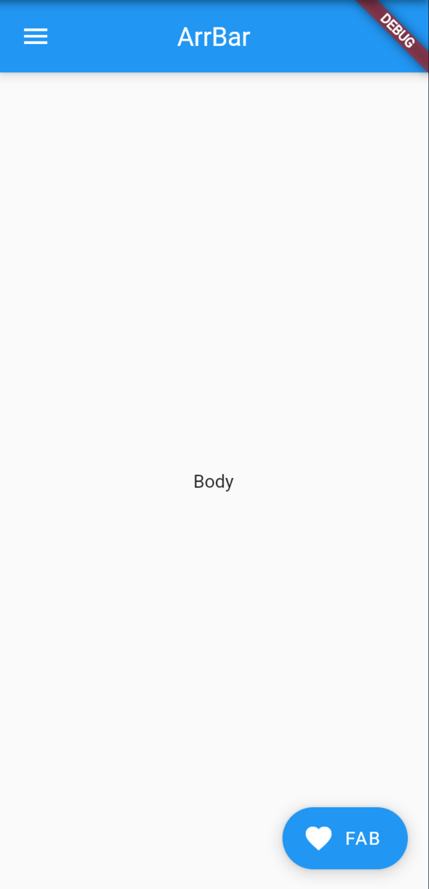
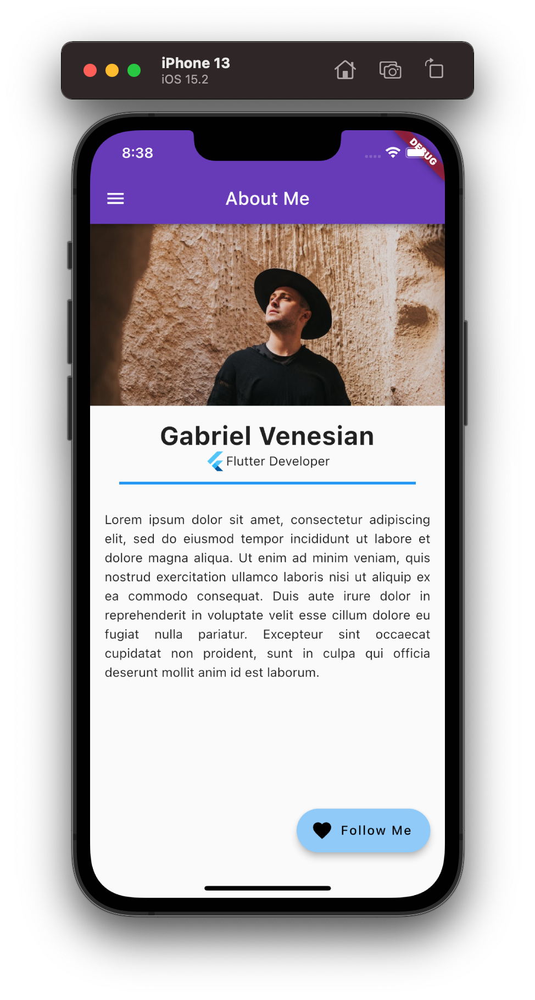
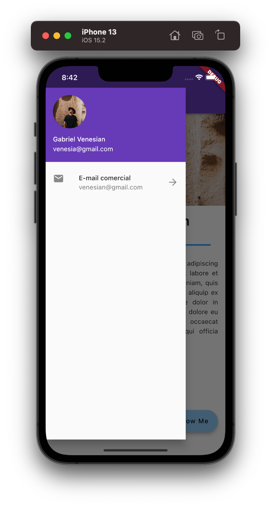

# f290_acf_about_me

## Getting Started

Este projeto tem por objetivo apresentar a estrutura de projetos Flutter e o uso do `Scaffold` em
aplicativos baseados no Android Material Design.

## Projeto Flutter

Crie um novo projeto Flutter para que possamos modificá-lo para utilização de uma estrutura mínima de projeto Flutter e depois utilizar os recursos do Widget `Scaffold`.

### Steps

#### Criando a estrutura do App utilizando Scaffold

1. Remova todo código da classe `main.dart` e substitua pelo trecho abaixo.

```dart
import 'package:flutter/material.dart';

main() => runApp(MyApp());

class MyApp extends StatelessWidget {
  @override
  Widget build(BuildContext context) {
    return MaterialApp(
      home: MyHomePage(),
    );
  }
}
```

> Esta é a estrutura minima para criacao de um App Flutter. Iremos pular alguns passos apresentados em video na sala de aula para agilizar o uso do Scaffold

2. Crie o `MyHomePage()`, esta classe irá representar uma tela de nosso App, será a `home` do nosso App, visto que poderemos ter varias telas. Inclua o trecho abaixo para criá-lo.

```dart
class MyHomePage extends StatelessWidget {
  const MyHomePage({Key? key}) : super(key: key);

  @override
  Widget build(BuildContext context) {
    return Scaffold(
    );
  }
}
```

> Neste ponte temos 2 Widgets, o `MyApp` que é base do aplicativo pois ele esta retornando o `MaterialApp` (estrututa para apps Android) com e este, exibirá o Widget `MyHomePage` como sua página principal.

#### Incluindo os componentes do Scaffold

1. Inclua a `AppBar` e ajuste o título do App. Atualize o código Scaffol.

```dart
@override
Widget build(BuildContext context) {
  return Scaffold(
    appBar: AppBar(title: Text('AppBar')),
  );
}
```

2. Inclua a `body`, o conteúdo do App.

```dart
@override
Widget build(BuildContext context) {
  return Scaffold(
    appBar: AppBar(title: Text('ArrBar')),
    body: Cemter(child: Text('Body')),
  );
}
```

3. Inclua o `FAB` (FloatingActionButton), como ação principal do App.

```dart
@override
Widget build(BuildContext context) {
  return Scaffold(
    appBar: AppBar(title: Text('ArrBar')),
    body: Cemter(child: Text('Body')),
    floatingActionButton: FloatingActionButton.extended(
      onPressed: () {},
      label: Text('FAB'),
      icon: Icon(Icons.favorite),
    ),
  );
}
```

4. Inclua o `Drawer` (FloatingActionButton), como ação principal do App.

```dart
@override
Widget build(BuildContext context) {
  return Scaffold(
    appBar: AppBar(title: Text('ArrBar')),
    drawer: Drawer(),
    body: Center(child: Text('Body')),
    floatingActionButton: FloatingActionButton.extended(
      onPressed: () {},
      label: Text('FAB'),
      icon: Icon(Icons.favorite),
    ),
  );
}
```

5. Execute o aplicativo ou teste no dartpad.dev para visualizar o `content area` da propriedade **body** conteúdo do Scaffold e os demais componentes adicionados.



> Chegando a este step, aproveite para testar o Hot Reload e Hot Restart; altere o título da AppBar, o conteudo no Body, altere a cor do App e visualize.

#### Adicionando conteúdo ao Scaffold

Neste ponto já criamos a estrutura do App com um Scaffold e iremos adicionar o conteúdo ao App.
É importante que voce compreenda a estrutura utiliza para podermos prosseguir conhecendo novos Widgets de conteúdo e Widgets de Layout; nossa widget tree tente a crescer e compreende-la desde os primeiros nós fará toda a diferença.

> O trecho abaixo trás uma coluna completa, mas recomendo que você adicione os Widgets um por vez e explore as propriedades de cada um deles para potencializar seu entendimento.

1. Inclua as variaveis url e sobre na classe `MyHomePage`.

```dart

class MyHomePage extends StatelessWidget {
  const MyHomePage({Key? key}) : super(key: key);

  final sobreMim = 'Descrição sobre você, afinal é um app sobre você!';
  final urlImagem = 'Link para uma imagem super estilosa sua!';
  
  // Restante do código aqui...
}
```

2. Remova o widget center da propriedade `body` e inclua o trecho abaixo.

```dart
    Column(
        mainAxisAlignment: MainAxisAlignment.start,
        children: [
          Image.network(
            urlImagem,
            height: 200,
            width: double.infinity,
            fit: BoxFit.cover,
          ),
          // O Padding controla o espço esterno com relação ao widget filho, neste caso apenas o espamento ao topo
          const Padding(
            padding: EdgeInsets.only(top: 16),
            child: Text(
              'Seu nome, DEV!',
              style: TextStyle(
                fontSize: 28,
                fontWeight: FontWeight.w700,
              ),
            ),
          ),
          // Exibir horizontamente o logo Flutter e o texto Flutter Developer
          Row(
            // Centraliza o conteúdo da Row
            mainAxisAlignment: MainAxisAlignment.center,
            children: const [
              FlutterLogo(), // Logo Flutter
              Text('Flutter Developer'),
            ],
          ),
          // O Divider possui propriedades que faclitam a separação de conteúdos
          const Divider(
            indent: 32,
            endIndent: 32,
            height: 24,
            thickness: 3,
            color: Colors.blue,
          ),
          Padding(
            padding: const EdgeInsets.all(16),
            child: Text(
              sobreMim,
              // Ajueste de espaçamento entre linhas
              style: const TextStyle(height: 1.5),
              // AJuste de elinhamento de texto justificado
              textAlign: TextAlign.justify,
            ),
          ),
        ],
      ),
```

3. **Teste o App e capriche nas informações**
4. Adicione o conteúdo ao Drawer para melhorar ainda mais! No compenente Drawer, ajuste o código com o trecho abaixo. 

```dart
Drawer(
  child: ListView(
    children: [
      UserAccountsDrawerHeader(
        currentAccountPicture: CircleAvatar(
          backgroundImage: NetworkImage(imageUrl),
        ),
        accountName: Text('Seu nome, DEV'),
        accountEmail: Text('dev@gmail.com'),
      ),
      ListTile(
        leading: Icon(Icons.email),
        title: Text('E-mail comercial'),
        subtitle: Text('dev@gmail.com'),
        trailing: Icon(Icons.arrow_forward),
      ),
    ],
  ),
)
```

5. Este será o resultado final, mas com os seus dados.






